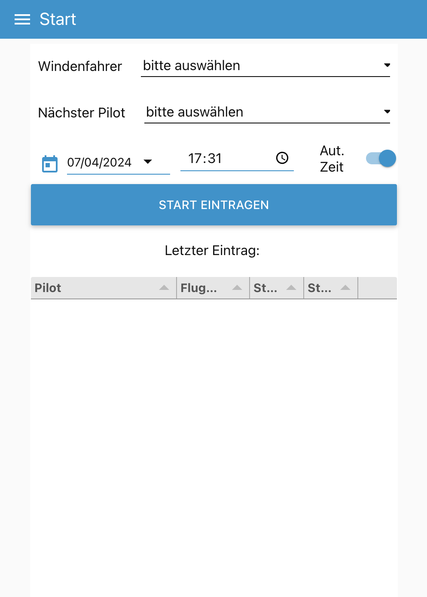
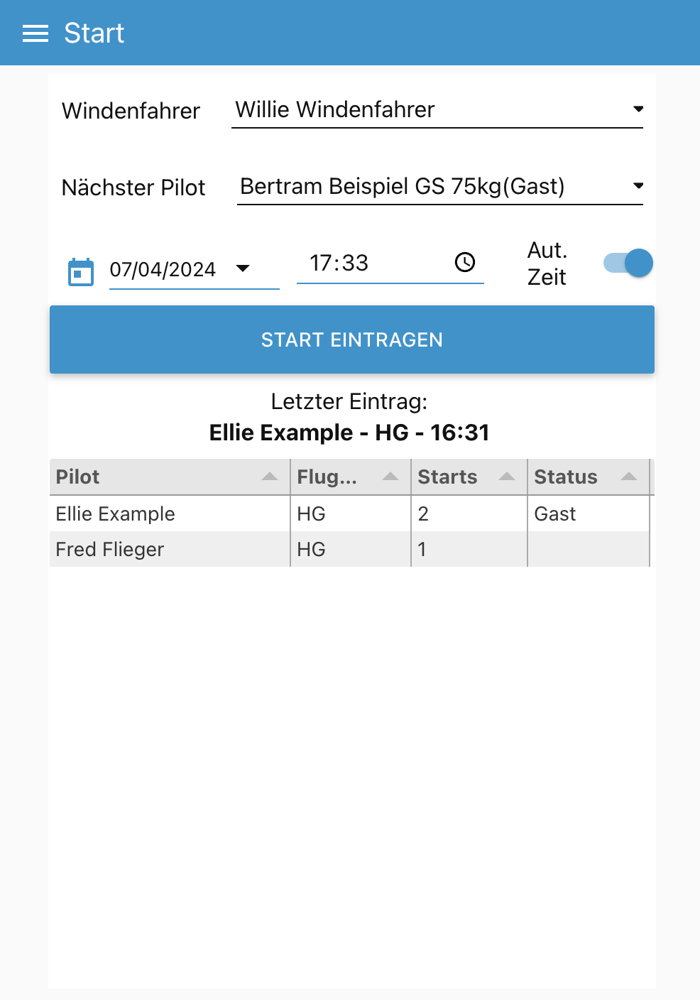
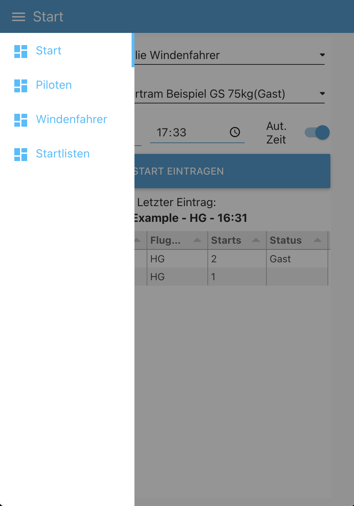
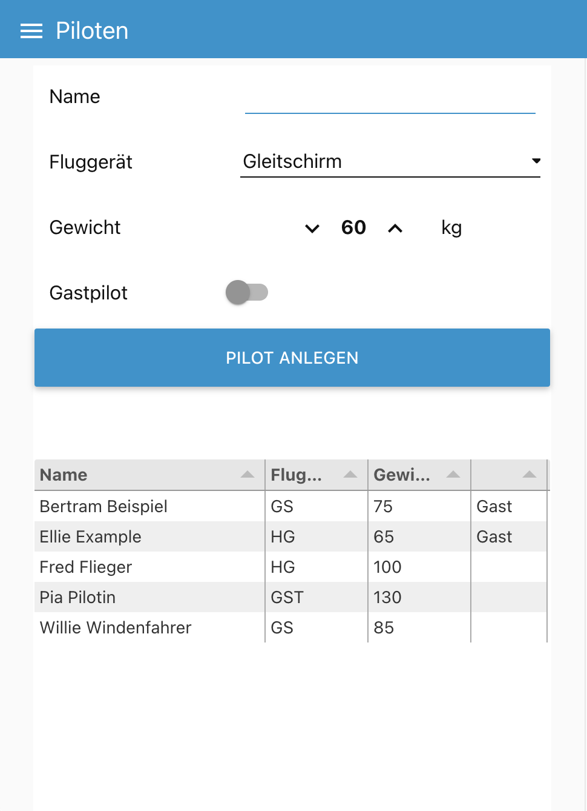
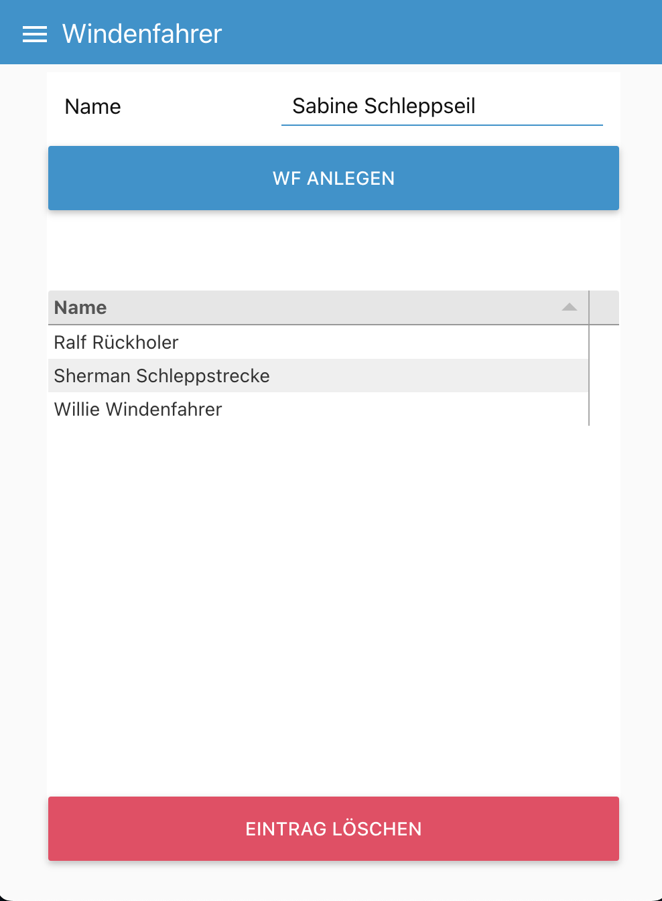
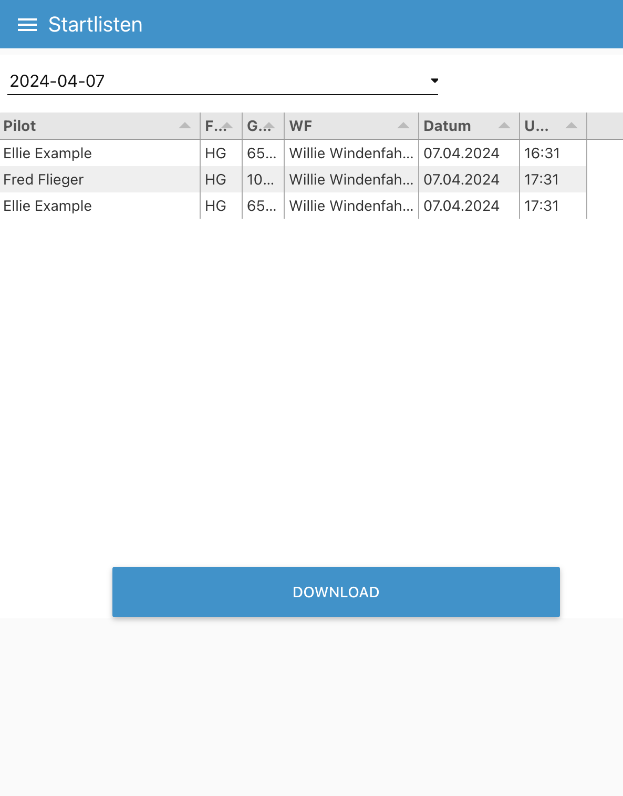

# Startlisten DfC Weser e.V.

Dieses Projekt ist ein Versuch die Startlisten beim Windenstart mit Gleitschirmen und Hängegleitern zu digitalisieren.
In unserem Verein führen wir die Startlisten auf der Winde. Die Papierlisten sind in der Handhabung recht praktisch,
jedoch ist die Abrechnung von Gästen sowie die jährliche Erstellung einer Statistik etwas mühsam.

Wir wollen nun versuchsweise einen SBC (Single Board Computer) wie den Raspberry Pi, inkl. eines Touchscreens auf der Winde installieren.
Darauf wird dann ein Docker-Container mit node red laufen, der den hier veröffentlichten flow enthält.

Wie praxistauglich das Ganze ist muss sich erst noch zeigen, da es erfahrungsgemäß immer ein paar Hürden beim Thema Digitalisierung gibt.
Hier wären das beispielsweise Sonnenlicht + Bildschirm, Bedienbarkeit der Software, Zuverlässigkleit des Systems, etc.

Zur Installation in node red werden die folgenden Paletten zusätzlich benötigt:
- node-red-contrib-filesystem
- node-red-dashboard
- node-red-node-ui-table

Eine detailliertere Beschreibung zur Installation, sowie eine Bedienungsanleitung werden demnächst hier hinterlegt.
Die Bedienung der Web-Oberfläche ist im wesentlichen aber selbsterklärend. Voraussetzung für die Installation sind Grundkenntnisse
im Umgang mit [node red](https://nodered.org/). Wir empfehlen node red mit [Docker](https://www.docker.com/) zu installieren: https://hub.docker.com/r/nodered/node-red

Das Projekt "DfC Weser Startlisten" steht frei zur Verfügung und kann ohne Einschränkungen kopiert, verändert und weitergegeben werden.
Wir würden uns freuen Rückmeldungen von anderen Gleitschirm- und Drachenflug-Vereinen zu bekommen.
Rückfragen bitte per E-Mail an martin(at)dfcweser.de

https://dfcweser.de

Hier noch ein paar Screenshots:

<table border=0>
<tr><td></td>
<td></td></tr>
<tr><td>
<td></td></tr>
<tr><td></td>
<td></td></tr>
</table>
